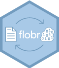

<!-- README.md is generated from README.Rmd. Please edit that file -->

# flobr 

<!-- badges: start -->

[](https://www.tidyverse.org/lifecycle/#maturing)
[](https://travis-ci.org/poissonconsulting/flobr)
[](https://ci.appveyor.com/project/poissonconsulting/flobr)
[](https://codecov.io/github/poissonconsulting/flobr?branch=master)
[](https://opensource.org/licenses/MIT)
[](https://CRAN.R-project.org/package=flobr)
[](https://cran.r-project.org/package=flobr)

<!-- badges: end -->

## Introduction

`flobr` is an R package to convert files to and from flobs.

A flob is a file that was read into binary in integer-mode as little
endian, saved as the single element of a named list (where the name is
the name of the original file including its extension) and then
serialized before being coerced into a blob.

Flobs are useful for writing and reading files to and from databases.

## Demonstration

``` r
library(flobr)

path <- system.file("extdata", "flobr.pdf", package = "flobr")

flob <- flob(path)
str(flob)
#> List of 1
#>  $ /Library/Frameworks/R.framework/Versions/3.6/Resources/library/flobr/extdata/flobr.pdf: raw [1:133851] 58 0a 00 00 ...
#>  - attr(*, "class")= chr [1:2] "flob" "blob"
flob_name(flob)
#> [1] "flobr"
flob_ext(flob)
#> [1] "pdf"

unflob(flob, tempdir())

all.equal(flob, flob(file.path(tempdir(), "flobr.pdf")), check.attributes = FALSE)
#> [1] TRUE
```

## Installation

To install the latest release version from
[CRAN](https://cran.r-project.org)

``` r
install.packages("flobr")
```

To install the latest development version from
[GitHub](https://github.com/poissonconsulting/flobr)

``` r
# install.packages("remotes")
remotes::install_github("poissonconsulting/flobr")
```

## Creditation

The [blob](https://github.com/tidyverse/blob) package.

The hex was designed by [The Forest](http://www.theforest.ca).

## Contribution

Please report any
[issues](https://github.com/poissonconsulting/flobr/issues).

[Pull requests](https://github.com/poissonconsulting/flobr/pulls) are
always welcome.

Please note that this project is released with a [Contributor Code of
Conduct](https://github.com/poissonconsulting/flobr/blob/master/CODE_OF_CONDUCT.md).
By contributing, you agree to abide by its terms.
